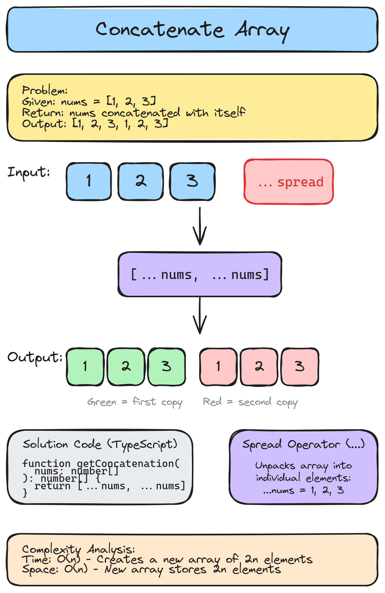

# 🔢 Solution 14 — Concatenate Array

> **📁 File:** `src/concatenate-array/solution.ts`



## 📋 Problem

Given an integer array `nums` of length `n`, return the concatenation of `nums` with itself (i.e., `nums` repeated twice).

**🎯 Example:**
```
Input:  nums = [1, 2, 3]
Output: [1, 2, 3, 1, 2, 3]
```

## 💻 The Code

```typescript
export function getConcatenation(nums: number[]): number[] {
  return [...nums, ...nums]
}
```

## 📖 Step-by-Step Explanation

Let's say input is:

```ts
nums = [1, 2, 3]
```

The spread operator `...` unpacks the array into individual elements.

```ts
[...nums, ...nums]
→ [1, 2, 3, 1, 2, 3]
```

That's it — one line, no loops needed.

### ⏱️ Complexity

| Metric | Value | Why |
|--------|-------|-----|
| 🕐 Time | `O(n)` | Creates a new array of 2n elements |
| 💾 Space | `O(n)` | New array stores 2n elements |

### ▶️ How to Run

```bash
npx tsx src/concatenate-array/solution.ts
```

---
