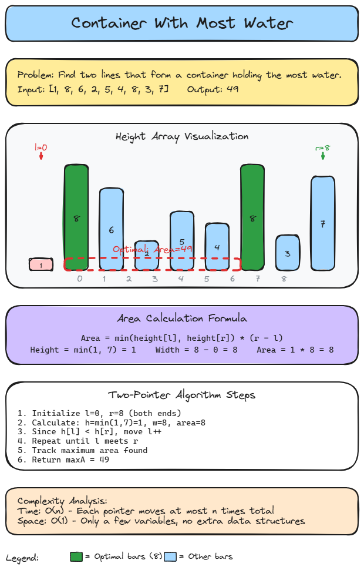

# 👈 Solution 13 — Container With Most Water

> **📁 File:** `src/container-with-most-water/solution.ts`


## 📋 Problem

Given `n` non-negative integers `a1, a2, ..., an` where each represents a point at coordinate `(i, ai)`, find two lines that together with the x-axis form a container that holds the most water.

**🎯 Example:**
```
Input:  [1, 8, 6, 2, 5, 4, 8, 3, 7]
Output: 49
```

## 💻 The Code

```ts
export function maxArea(heights: number[]): number {
  let l = 0;
  let r = heights.length - 1;

  let maxA = 0;

  while (l < r) {
    let h = Math.min(heights[l]!, heights[r]!);
    let w = r - l;
    let a = h * w;
    maxA = Math.max(maxA, a);
    if (heights[l]! < heights[r]!) {
      l++;
    } else {
      r--;
    }
  }

  return maxA;
}
```

## 📖 Step-by-Step Explanation

1. **Initialize two pointers** at both ends of the array (`l = 0`, `r = n - 1`).
2. **Calculate the area** using the shorter line as height and the distance between pointers as width.
3. **Track the maximum** area seen so far.
4. **Move the shorter pointer inward** — moving the taller one can never increase the area since the width decreases while height stays bounded by the shorter line.
5. **Repeat** until pointers meet.

**Concrete example** with `[1, 8, 6, 2, 5, 4, 8, 3, 7]`:
- l=0, r=8: h=min(1,7)=1, w=8, area=8. Move l.
- l=1, r=8: h=min(8,7)=7, w=7, area=49. Move r.
- l=1, r=7: h=min(8,3)=3, w=6, area=18. Move r.
- ...continues until l meets r, returning 49.

### ⏱️ Complexity

| Metric | Value | Why |
|--------|-------|-----|
| 🕐 Time | `O(n)` | Each pointer moves at most n times total |
| 💾 Space | `O(1)` | Only a few variables, no extra data structures |

### ▶️ How to Run

```bash
npx tsx src/container-with-most-water/solution.ts
```

---


