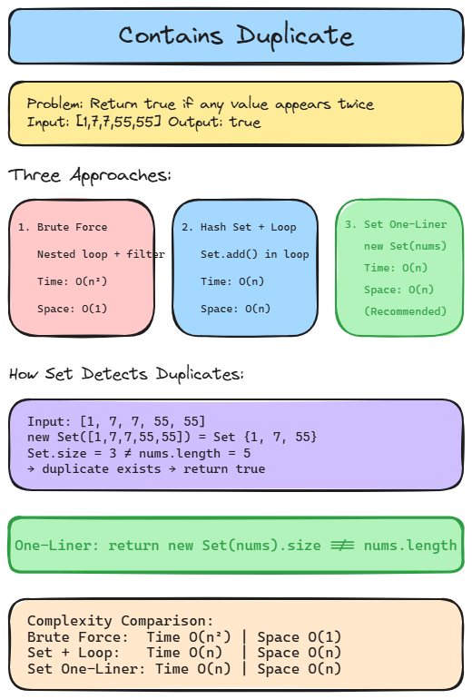

# Contains Duplicate — 3 Approaches (Day 1 Progress)


**Problem:** Given an array of numbers, return `true` if any value appears at least twice, otherwise return `false`.

This README walks through the three solutions I wrote, in the order I wrote them, and why each one is an improvement over the last.

---

## Solution 1 — Brute Force (Nested Check)

```typescript
const Solution = {
  hasDuplicate(nums: number[]): boolean {
    let isTrue = false;
    for (let index = 0; index < nums.length && isTrue === false; index++) {
      const element = nums[index] as number;
      const checkTrue = check(element);

      if (checkTrue) {
        isTrue = true;
        return true;
      }
    }

    function check(value: number) {
      const count = nums.filter((num) => num === value);
      if (count.length > 1) {
        return true;
      } else {
        return false;
      }
    }
    return isTrue;
  },
};
```

**How it works:**
For every element in the array, it calls `check()`, which uses `.filter()` to scan the _entire_ array again and count how many times that value shows up. If it shows up more than once, we found a duplicate.

**Why it works but isn't ideal:**

- For each of the `n` elements, `check()` does another full pass over the array (`.filter()` is O(n)).
- That means total work is roughly `n × n` = **O(n²) time**.
- On small arrays like `[1, 7, 7, 55, 55]` this is instant. On an array of 100,000 numbers, this becomes very slow (10 billion comparisons).

**Space:** O(1) extra space (ignoring the temporary array `.filter()` creates each call).

This is a completely valid first attempt — it's the "make it work" step, and it correctly solves the problem. The improvement from here is about _efficiency_, not correctness.

---

## Solution 2 — Hash Set with a Loop

```typescript
const Solution = {
  hasDuplicate(nums: number[]): boolean {
    const NewSet = new Set();

    for (let index = 0; index < nums.length; index++) {
      const element = nums[index];
      NewSet.add(element);
    }

    return NewSet.size !== nums.length;
  },
};
```

**How it works:**
A `Set` in JavaScript/TypeScript automatically ignores duplicate values — adding the same value twice only stores it once. So:

- Loop through every number and add it to the `Set`.
- A `Set` can never have _more_ unique values than the original array had elements.
- If the array had duplicates, the `Set` ends up **smaller** than `nums.length`.
- Compare sizes: if they differ, duplicates existed.

**Why it's better:**

- `Set.add()` is O(1) on average.
- One single pass through the array → **O(n) time** instead of O(n²).
- This is the key insight that unlocks the fast solution: trade a bit of memory for a lot of speed.

**Space:** O(n) — in the worst case (no duplicates), the Set stores every element.

---

## Solution 3 — Hash Set, One-Liner

```typescript
const Solution = {
  hasDuplicate3(nums: number[]): boolean {
    return new Set(nums).size !== nums.length;
  },
};
```

**How it works:**
Exactly the same idea as Solution 2, just written more concisely. `new Set(nums)` accepts an iterable directly, so JavaScript builds the deduplicated set in one step instead of manually looping and calling `.add()` each time.

**Why it's the same performance, just cleaner:**

- Still **O(n) time** and **O(n) space** — the engine is doing the same work internally, just without you writing the loop yourself.
- More readable: the _intent_ ("dedupe the array, then compare sizes") is obvious at a glance.

---

## Summary Table

| Version | Technique            | Time  | Space | Notes                            |
| ------- | -------------------- | ----- | ----- | -------------------------------- |
| 1       | Nested loop + filter | O(n²) | O(1)  | Correct but slow on large inputs |
| 2       | Set + manual loop    | O(n)  | O(n)  | Big improvement — one pass       |
| 3       | Set one-liner        | O(n)  | O(n)  | Same speed as #2, cleaner code   |

## Takeaway

The jump from Solution 1 to Solution 2 is the important one: recognizing that a hash-based structure (`Set`) can check "have I seen this before?" in constant time, instead of re-scanning the array each time. Solution 3 doesn't change the algorithm at all — it's just a more idiomatic way to express the same logic once you're comfortable with `Set`.


