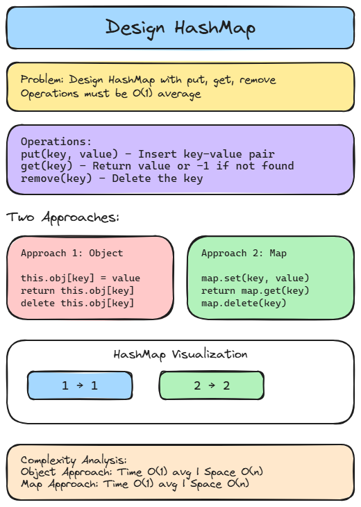

# 🔐 Solution 16 — Design HashMap

> **📁 File:** `src/design-hashmap/solution.ts`



## 📋 Problem

Design a HashMap without using any built-in hash table libraries. Implement `MyHashMap` class with `put(key, value)`, `get(key)`, and `remove(key)`.

**🎯 Example:**
```
Input: put(1,1), put(2,2), get(1) → 1, remove(1), get(1) → -1
```

## 💻 The Code

### 🔸 Approach 1 — Using Object

```typescript
export class MyHashMap {
  private obj: { [key: number]: number };
  constructor() {
    this.obj = {};
  }

  put(key: number, value: number): void {
    this.obj[key] = value;
    console.log(this.obj[key]);
  }

  get(key: number): number {
    if (this.obj[key] !== undefined) {
      return this.obj[key];
    } else {
      return -1;
    }
  }

  remove(key: number): void {
    delete this.obj[key];
  }
}
```

### 🔹 Approach 2 — Using Map

```typescript
export class MyHashMapSimpleSolution {
  private map: Map<number, number>;
  constructor() {
    this.map = new Map<number, number>();
  }

  put(key: number, value: number): void {
    this.map.set(key, value);
  }

  get(key: number): number {
    const value = this.map.get(key);
    if (value !== undefined) {
      return value;
    } else {
      return -1;
    }
  }

  remove(key: number): void {
    this.map.delete(key);
  }
}
```

## 📖 Step-by-Step Explanation

**Approach 1 (Object):**
1. Use a plain JS object as the underlying storage.
2. `put` assigns a key-value pair directly.
3. `get` checks if the key exists, returns -1 if not.
4. `remove` uses `delete` to erase the key.

**Approach 2 (Map):**
1. Use JavaScript's built-in `Map` for cleaner semantics.
2. `put` calls `map.set()`.
3. `get` calls `map.get()` and returns -1 if undefined.
4. `remove` calls `map.delete()`.

### ⏱️ Complexity

| Approach | ⏱️ Time | 💾 Space | Notes |
|----------|---------|---------|-------|
| 🔸 Object | O(1) average | O(n) | Simple but no guaranteed performance |
| 🔹 Map | O(1) average | O(n) | Cleaner API, same complexity |

### ▶️ How to Run

```bash
npx tsx src/design-hashmap/solution.ts
```

---
