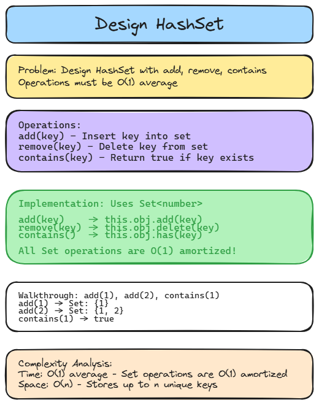

# 🔒 Solution 17 — Design HashSet

> **📁 File:** `src/design-hashset/solution.ts`



## 📋 Problem

Design a HashSet without using any built-in hash table libraries. Implement `MyHashSet` class with `add(key)`, `remove(key)`, and `contains(key)`.

**🎯 Example:**
```
Input: add(1), add(2), contains(1) → true, contains(3) → false, remove(1), contains(1) → false
```

## 💻 The Code

```typescript
export function MyHashSet() {
  return class {
    private obj: Set<number>;
    constructor() {
      this.obj = new Set<number>();
    }

    add(key: number): void {
      this.obj.add(key);
    }

    remove(key: number): void {
      this.obj.delete(key);
    }

    contains(key: number): boolean {
      if (this.obj.has(key)) return true;
      return false;
    }
  };
}
```

## 📖 Step-by-Step Explanation

1. Wrap a class in a factory function returning it.
2. Use `Set<number>` as the underlying storage.
3. `add` delegates to `Set.add()`.
4. `remove` delegates to `Set.delete()`.
5. `contains` checks with `Set.has()` and returns a boolean.

**Walkthrough with `add(1), add(2), contains(1)`:**
- `add(1)` → Set becomes `{1}`
- `add(2)` → Set becomes `{1, 2}`
- `contains(1)` → Set has 1 → returns `true`

### ⏱️ Complexity

| Metric | Value | Why |
|--------|-------|-----|
| 🕐 Time | `O(1)` average | Set operations are O(1) amortized |
| 💾 Space | `O(n)` | Stores up to n unique keys |

### ▶️ How to Run

```bash
npx tsx src/design-hashset/solution.ts
```

---
