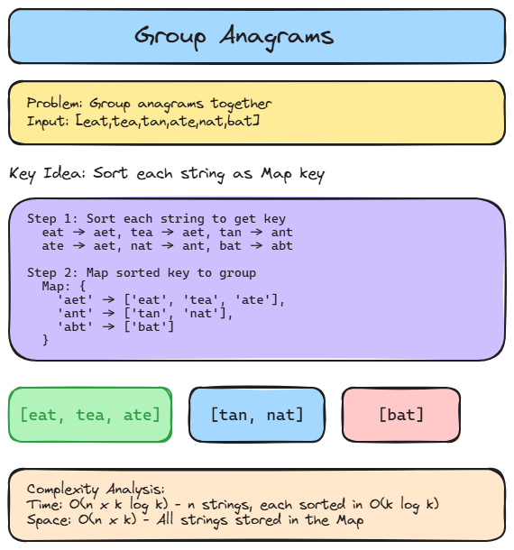

# 🗂️ Solution 5 — Group Anagrams

> **📁 File:** `src/group-anagrams/solution.ts`


## 📋 Problem

Given an array of strings, group the anagrams together.

**🎯 Example:**
```
Input:  ["eat", "tea", "tan", "ate", "nat", "bat"]
Output: [["eat", "tea", "ate"], ["tan", "nat"], ["bat"]]
```

## 💻 The Code

```typescript
export function groupAnagrams(strs: string[]): string[][] {
  const anagramGroups = new Map<string, string[]>();

  for (const str of strs) {
    const sortedKey = [...str].sort().join("");
    if (!anagramGroups.has(sortedKey)) {
      anagramGroups.set(sortedKey, []);
    }

    anagramGroups.get(sortedKey)!.push(str);
  }
  return Array.from(anagramGroups.values());
}
```

## 📖 Step-by-Step Explanation

Let's say input is:

```ts
["act", "pots", "tops", "cat", "stop", "hat"]
```

First, create an empty Map.

```ts
const anagramGroups = new Map<string, string[]>();
```

Map is now:

```
Map {}
```

---

### 🔄 1st Iteration

```ts
str = "act"
```

Sort it:

```ts
const sortedKey = "act";
```

"act" is not in the Map as a key.

```ts
anagramGroups.set("act", []);
```

Map is now:

```
{
  "act" => []
}
```

Now:

```ts
anagramGroups.get("act")!.push("act");
```

`get("act")` returns:

```
[]
```

So:

```ts
[].push("act")
```

becomes:

```
["act"]
```

Map is now:

```
{
  "act" => ["act"]
}
```

---

### 🔄 2nd Iteration

```ts
str = "pots"
```

Sort it:

```
opst
```

Not in the Map.

```
{
   "act" => ["act"],
   "opst" => []
}
```

Then push:

```ts
.push("pots")
```

becomes:

```
{
   "act" => ["act"],
   "opst" => ["pots"]
}
```

---

### 🔄 3rd Iteration

```ts
str = "tops"
```

Sort it:

```
opst
```

Key already exists!

```ts
anagramGroups.get("opst")
```

returns:

```
["pots"]
```

Then:

```ts
["pots"].push("tops")
```

becomes:

```
["pots", "tops"]
```

Map:

```
{
   "act" => ["act"],
   "opst" => ["pots", "tops"]
}
```

---

### 🔄 4th Iteration

```ts
str = "cat"
```

Sort it:

```
act
```

Key exists!

```ts
anagramGroups.get("act")
```

returns:

```
["act"]
```

Then:

```ts
["act"].push("cat")
```

becomes:

```
["act", "cat"]
```

Map:

```
{
   "act" => ["act", "cat"],
   "opst" => ["pots", "tops"]
}
```

> 🎉 This is where `cat` and `act` end up together.

---

### 🔄 5th Iteration

```ts
str = "stop"
```

Sort:

```
opst
```

Map:

```
["pots", "tops"]
```

After push:

```
["pots", "tops", "stop"]
```

---

### 🔄 6th Iteration

```ts
str = "hat"
```

Sort:

```
aht
```

New key:

```
"aht" => []
```

After push:

```
"aht" => ["hat"]
```

---

### 📋 Final Map

```
{
   "act" => ["act", "cat"],
   "opst" => ["pots", "tops", "stop"],
   "aht" => ["hat"]
}
```

Then:

```ts
Array.from(anagramGroups.values())
```

Extracts only the values:

```
[
  ["act", "cat"],
  ["pots", "tops", "stop"],
  ["hat"]
]
```

---

### 🔍 How `get(sortedKey)!.push(str)` works

Say:

```ts
const map = new Map();
map.set("fruit", []);
```

Then:

```ts
map.get("fruit")
```

returns:

```
[]
```

Now:

```ts
const arr = map.get("fruit");
arr.push("Apple");
```

`arr` and the array inside the Map point to **the same array object**.

```
arr
 │
 ▼
["Apple"]

Map
"fruit"
   │
   ▼
["Apple"]
```

So:

```ts
arr.push("Apple");
```

and:

```ts
map.get("fruit")!.push("Apple");
```

do the same thing.

---

### ❓ Why the `!` ?

```ts
anagramGroups.get(sortedKey)
```

has type:

```
string[] | undefined
```

Because `get()` can return `undefined` if the key doesn't exist.

But we just made sure the key exists:

```ts
if (!anagramGroups.has(sortedKey)) {
    anagramGroups.set(sortedKey, []);
}
```

So by the time we reach the next line, the key is guaranteed to exist.

We tell TypeScript:

```ts
anagramGroups.get(sortedKey)!
```

> 🗣️ "I'm sure this is not `undefined`."

This is called the **non-null assertion operator (`!`)**.

---

### ⏱️ Complexity

| Metric | Value | Why |
|--------|-------|-----|
| 🕐 Time | `O(n × k log k)` | n strings, each sorted in O(k log k) |
| 💾 Space | `O(n × k)` | All strings stored in the Map |

### ▶️ How to Run

```bash
npx tsx src/group-anagrams/solution.ts
```

---


