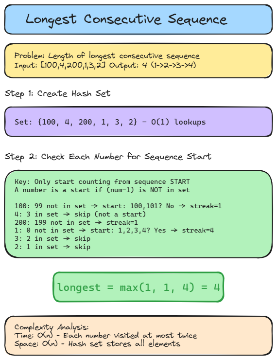

# 🔗 Solution 9 — Longest Consecutive Sequence

> **📁 File:** `src/longest-consecutive-sequence/solution.ts`


## 📋 Problem

Given an unsorted array of integers `nums`, return the length of the longest consecutive elements sequence. You must write an algorithm that runs in O(n) time.

**🎯 Example:**
```
Input: nums = [100, 4, 200, 1, 3, 2]
Output: 4
Explanation: The longest consecutive sequence is [1, 2, 3, 4]. Therefore its length is 4.
```

## 💻 The Code

```typescript
export function longestConsecutive(nums: number[]): number {
  if (nums.length === 0 || nums === null) {
    return 0;
  }
  const set = new Set(nums);
  let longest = 0;
  for (const num of set) {
    if (!set.has(num - 1)) {
      let currentNum = num;
      let currentStreak = 1;
      while (set.has(currentNum + 1)) {
        currentNum++;
        currentStreak++;
      }
      longest = Math.max(longest, currentStreak);
    }
  }
  return longest;
}
```

## 📖 Step-by-Step Explanation

1. **Handle edge cases**: Return 0 if array is empty or null
2. **Create hash set**: Convert array to Set for O(1) lookups
3. **Iterate through set**: For each number, check if it's the start of a sequence
4. **Check sequence start**: A number is a sequence start if `num - 1` doesn't exist in the set
5. **Count consecutive sequence**: From each start, count how many consecutive numbers exist
6. **Track longest streak**: Update longest with the maximum streak found
7. **Return result**: Return the length of the longest consecutive sequence

### 🧪 Test Cases

| Input | Output | Explanation |
|-------|--------|-------------|
| `[100, 4, 200, 1, 3, 2]` | `4` | Sequence: 1→2→3→4 |
| `[0, 3, 7, 2, 5, 8, 4, 6, 0, 1]` | `9` | Sequence: 0→1→2→3→4→5→6→7→8 |
| `[9, 1, 4, 7, 3, -1, 0, 5, 8, -1, 6]` | `7` | Sequence: -1→0→1→3→4→5→6→7→8 |
| `[1, 2, 0, 1]` | `3` | Sequence: 0→1→2 |
| `[]` | `0` | Empty array |
| `[1]` | `1` | Single element |
| `[1, 2, 3, 100, 101, 102, 103]` | `4` | Sequence: 100→101→102→103 |

### ▶️ Visual Walkthrough

```
Input: [100, 4, 200, 1, 3, 2]

Step 1: Create Set = {100, 4, 200, 1, 3, 2}

Step 2: Check each number:
  - 100: Is 99 in set? NO → Start counting: 100, 101? NO → streak = 1
  - 4: Is 3 in set? YES → Skip (not a sequence start)
  - 200: Is 199 in set? NO → Start counting: 200, 201? NO → streak = 1
  - 1: Is 0 in set? NO → Start counting: 2? YES → 3? YES → 4? YES → 5? NO → streak = 4
  - 3: Is 2 in set? YES → Skip
  - 2: Is 1 in set? YES → Skip

Step 3: longest = max(1, 1, 4) = 4

Output: 4
```

### ⏱️ Complexity

| Metric | Value | Why |
|--------|-------|-----|
| 🕐 Time | `O(n)` | Each number is visited at most twice (once in loop, once in while) |
| 💾 Space | `O(n)` | Hash set stores all n elements |

### ▶️ How to Run

```bash
npx tsx src/longest-consecutive-sequence/solution.ts
```

---


