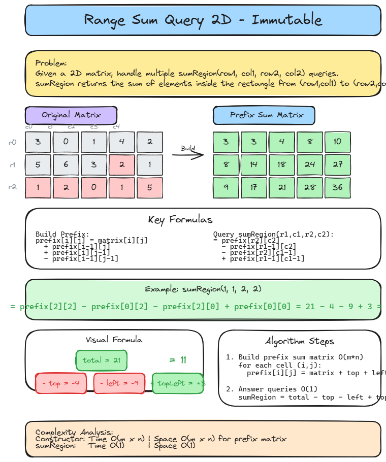

# ➕ Solution 21 — Range Sum Query 2D

> **📁 File:** `src/range-sum-query-2d/solution.ts`
> 📊 **Diagram:** [diagram.excalidraw](./diagram.excalidraw)


## 📋 Problem

Given a 2D matrix `matrix`, handle multiple queries of the following type: calculate the **sum of the elements** of the matrix inside the rectangle defined by its upper left corner `(row1, col1)` and lower right corner `(row2, col2)`.

**🎯 Example:**
```
Input: matrix = [
  [3, 0, 1, 4, 2],
  [5, 6, 3, 2, 1],
  [1, 2, 0, 1, 5],
  [4, 1, 0, 1, 7],
  [1, 0, 3, 0, 5]
]

sumRegion(2, 1, 4, 3) → 8
sumRegion(1, 1, 2, 2) → 11
sumRegion(1, 2, 2, 4) → 12
```

## 💻 The Code

### 🔹 Approach 1 — Prefix Sum Matrix (Optimal)

```typescript
export class NumMatrix1 {
  private prefix: number[][];

  constructor(matrix: number[][]) {
    if (matrix.length === 0 || matrix[0]!.length === 0) {
      this.prefix = [];
      return;
    }

    const m = matrix.length;
    const n = matrix[0]!.length;

    this.prefix = Array.from({ length: m }, () => new Array<number>(n).fill(0));

    for (let i = 0; i < m; i++) {
      for (let j = 0; j < n; j++) {
        const top = i > 0 ? this.prefix[i - 1]![j]! : 0;
        const left = j > 0 ? this.prefix[i]![j - 1]! : 0;
        const topLeft = i > 0 && j > 0 ? this.prefix[i - 1]![j - 1]! : 0;

        this.prefix[i]![j] = matrix[i]![j]! + top + left - topLeft;
      }
    }
  }

  sumRegion(row1: number, col1: number, row2: number, col2: number): number {
    const total = this.prefix[row2]![col2]!;
    const top = row1 > 0 ? this.prefix[row1 - 1]![col2]! : 0;
    const left = col1 > 0 ? this.prefix[row2]![col1 - 1]! : 0;
    const topLeft =
      row1 > 0 && col1 > 0 ? this.prefix[row1 - 1]![col1 - 1]! : 0;

    return total - top - left + topLeft;
  }
}
```

## 📖 Step-by-Step Explanation

### 🔹 Key Idea — Prefix Sum

Instead of recalculating the sum for every query, we precompute a **prefix sum matrix** where each cell `(i, j)` stores the sum of all elements in the rectangle from `(0, 0)` to `(i, j)`.

**Formula for building prefix matrix:**
```
prefix[i][j] = matrix[i][j] + prefix[i-1][j] + prefix[i][j-1] - prefix[i-1][j-1]
```

**Formula for answering queries:**
```
sumRegion(r1, c1, r2, c2) = prefix[r2][c2] - prefix[r1-1][c2] - prefix[r2][c1-1] + prefix[r1-1][c1-1]
```

---

### 📖 Step-by-Step — Building Prefix Matrix

Given matrix:
```
[3, 0, 1, 4, 2]
[5, 6, 3, 2, 1]
[1, 2, 0, 1, 5]
[4, 1, 0, 1, 7]
[1, 0, 3, 0, 5]
```

**prefix[0][0]:**
```
top = 0, left = 0, topLeft = 0
prefix[0][0] = 3 + 0 + 0 - 0 = 3
```

**prefix[0][1]:**
```
top = 0, left = 3, topLeft = 0
prefix[0][1] = 0 + 0 + 3 - 0 = 3
```

Continue for all cells...

**Final prefix matrix:**
```
[3,  3,  4,  8, 10]
[8, 14, 18, 24, 27]
[9, 17, 21, 28, 36]
[13, 22, 26, 34, 49]
[14, 23, 30, 38, 58]
```

---

### 📖 Step-by-Step — Answering Query sumRegion(2, 1, 4, 3)

We want sum of elements from `(2,1)` to `(4,3)`:

```
[2, 0, 1]
[1, 0, 1]
[0, 3, 0]
```

Using the formula:
```
total = prefix[4][3] = 38
top = prefix[1][3] = 24
left = prefix[4][0] = 14
topLeft = prefix[1][0] = 8

sumRegion = 38 - 24 - 14 + 8 = 8
```

> 🎉 **Correct!** Sum is 8.

---

### 🎯 Visual Summary

```
Matrix:                 Prefix Sum:
[3, 0, 1, 4, 2]        [3,  3,  4,  8, 10]
[5, 6, 3, 2, 1]   →    [8, 14, 18, 24, 27]
[1, 2, 0, 1, 5]        [9, 17, 21, 28, 36]
[4, 1, 0, 1, 7]        [13, 22, 26, 34, 49]
[1, 0, 3, 0, 5]        [14, 23, 30, 38, 58]
```

---

### ❓ Why subtract topLeft?

When we subtract `top` and `left`, we subtract the topLeft region twice. Adding it back corrects the double subtraction (inclusion-exclusion principle).

---

### ⏱️ Complexity

| Operation | ⏱️ Time | 💾 Space |
|-----------|---------|---------|
| Constructor (precompute) | `O(m × n)` | `O(m × n)` |
| sumRegion (query) | `O(1)` | `O(1)` |

### ▶️ How to Run

```bash
npx tsx src/range-sum-query-2d/solution.ts
```

---


