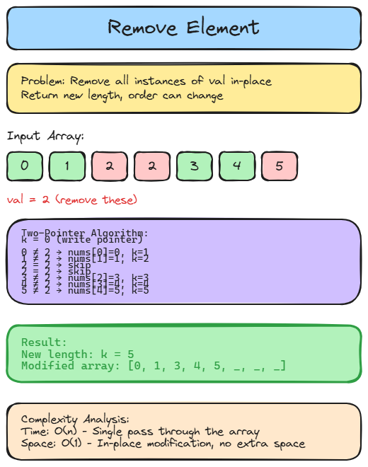

# 👉 Solution 19 — Remove Element

> **📁 File:** `src/remove-element/solution.ts`



## 📋 Problem

Given an array `nums` and a value `val`, remove all instances of `val` in-place and return the new length. The order of elements can be changed.

**🎯 Example:**
```
Input: nums = [3,2,2,3], val = 3 → Output: 2, nums = [2,2,_,_]
Input: nums = [0,1,2,2,3,0,4,2], val = 2 → Output: 5, nums = [0,1,4,0,3,_,_,_]
```

## 💻 The Code

```typescript
export function removeElement(nums: number[], val: number): number {
  let k = 0;
  for (const num of nums) {
    if (num !== val) {
      nums[k] = num;
      k++;
    }
  }

  return k;
}
```

## 📖 Step-by-Step Explanation

1. Use a pointer `k` to track where the next non-val element should go.
2. Iterate through the array — if the current element is NOT `val`, place it at `nums[k]` and increment `k`.
3. Elements after `k` don't matter (they can be anything).
4. Return `k` as the new length.

**Walkthrough with `[0,1,2,2,3,0,4,2]`, val = 2:**
- `0` ≠ 2 → nums[0]=0, k=1
- `1` ≠ 2 → nums[1]=1, k=2
- `2` = 2 → skip
- `2` = 2 → skip
- `3` ≠ 2 → nums[2]=3, k=3
- `0` ≠ 2 → nums[3]=0, k=4
- `4` ≠ 2 → nums[4]=4, k=5
- `2` = 2 → skip
- Return `5`

### ⏱️ Complexity

| Metric | Value | Why |
|--------|-------|-----|
| 🕐 Time | `O(n)` | Single pass through the array |
| 💾 Space | `O(1)` | In-place modification, no extra space |

### ▶️ How to Run

```bash
npx tsx src/remove-element/solution.ts
```

---
