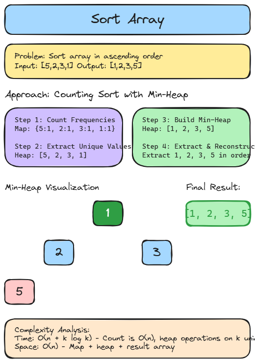

# 🔄 Solution 20 — Sort Array

> **📁 File:** `src/sort-array/solution.ts`



## 📋 Problem

Given an array of integers `nums`, sort the array in ascending order and return it. Must solve without using built-in sort functions.

**🎯 Example:**
```
Input: [5,2,3,1] → Output: [1,2,3,5]
Input: [5,1,1,2,0,0] → Output: [0,0,1,1,2,5]
```

## 💻 The Code

```typescript
export function sortArray(nums: number[]): number[] {
  const map = new Map<number, number>();

  for (let i = 0; i < nums.length; i++) {
    const num = nums[i]!;
    map.set(num, (map.get(num) ?? 0) + 1);
  }

  const heap: number[] = Array.from(map.keys());

  buildMinHeap(heap);

  nums.length = 0;

  while (heap.length > 0) {
    const smallest = extractMin(heap);
    const count = map.get(smallest);

    if (count === undefined) {
      continue;
    }

    for (let i = 0; i < count; i++) {
      nums.push(smallest);
    }
  }

  return nums;
}

function buildMinHeap(heap: number[]): void {
  const n: number = heap.length;
  for (let i = Math.floor(n / 2) - 1; i >= 0; i--) {
    heapifyDown(heap, n, i);
  }
}

function extractMin(heap: number[]): number {
  const min: number = heap[0]!;
  const last: number | undefined = heap.pop();

  if (last !== undefined && heap.length > 0) {
    heap[0] = last;
    heapifyDown(heap, heap.length, 0);
  }

  return min;
}

function heapifyDown(heap: number[], size: number, index: number): void {
  let smallest: number = index;
  const left: number = 2 * index + 1;
  const right: number = 2 * index + 2;

  if (left < size && heap[left]! < heap[smallest]!) {
    smallest = left;
  }
  if (right < size && heap[right]! < heap[smallest]!) {
    smallest = right;
  }

  if (smallest !== index) {
    const temp: number = heap[index]!;
    heap[index] = heap[smallest]!;
    heap[smallest] = temp;
    heapifyDown(heap, size, smallest);
  }
}
```

## 📖 Step-by-Step Explanation

This uses a **Counting Sort with Min-Heap** approach:

1. **Count frequencies** — Build a Map of `value → count`.
2. **Extract unique values** — Get all unique numbers into an array.
3. **Build Min-Heap** — Organize unique values so the smallest is always at the root.
4. **Extract and reconstruct** — Repeatedly extract the minimum, push its value `count` times into the result.

**Walkthrough with `[5,2,3,1]`:**
- Map: `{5:1, 2:1, 3:1, 1:1}`
- Unique: `[5, 2, 3, 1]` → build min-heap → `[1, 2, 3, 5]`
- Extract 1 → push 1 → nums = `[1]`
- Extract 2 → push 2 → nums = `[1, 2]`
- Extract 3 → push 3 → nums = `[1, 2, 3]`
- Extract 5 → push 5 → nums = `[1, 2, 3, 5]`

### ⏱️ Complexity

| Metric | Value | Why |
|--------|-------|-----|
| 🕐 Time | `O(n + k log k)` | Count is O(n), heap operations on k unique elements |
| 💾 Space | `O(n)` | Map + heap + result array |

### ▶️ How to Run

```bash
npx tsx src/sort-array/solution.ts
```

---
