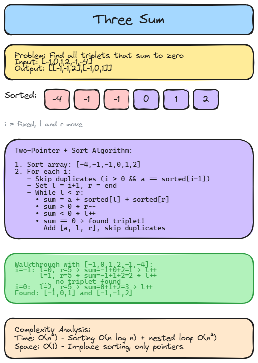

# 👈 Solution 12 — Three Sum

> **📁 File:** `src/three-sum/solution.ts`



## 📋 Problem

Given an integer array nums, return all the triplets [nums[i], nums[j], nums[k]] such that i != j, i != k, and j != k, and nums[i] + nums[j] + nums[k] == 0.

**🎯 Example:**
Input: nums = [-1, 0, 1, 2, -1, -4]
Output: [[-1, -1, 2], [-1, 0, 1]]

## 💻 The Code

```typescript
export function threeSum(nums: number[]): number[][] {
  const sorted = nums.sort((a, b) => a - b);
  const res: number[][] = [];

  for (let i = 0; i < sorted.length - 2; i++) {
    const a = sorted[i]!;

    if (i > 0 && a === sorted[i - 1]) {
      continue;
    }

    let l = i + 1;
    let r = sorted.length - 1;

    while (l < r) {
      const sum = a + sorted[l]! + sorted[r]!;

      if (sum > 0) {
        r--;
      } else if (sum < 0) {
        l++;
      } else {
        res.push([a, sorted[l]!, sorted[r]!]);

        l++;
        r--;

        while (l < r && sorted[l] === sorted[l - 1]) {
          l++;
        }

        while (l < r && sorted[r] === sorted[r + 1]) {
          r--;
        }
      }
    }
  }

  return res;
}
```

## 📖 Step-by-Step Explanation

1. **Sort the array** — This allows us to use two pointers and skip duplicates efficiently.
2. **Iterate with index `i`** — For each element, treat it as the first value of the triplet.
3. **Skip duplicates for `i`** — If `sorted[i] === sorted[i-1]`, skip to avoid duplicate triplets.
4. **Two pointers `l` and `r`** — Point to the elements after `i` and the end of the array.
5. **Check the sum:**
   - `sum > 0` → move `r` left to decrease the sum
   - `sum < 0` → move `l` right to increase the sum
   - `sum === 0` → found a triplet! Add it, then skip duplicates for both `l` and `r`

### ⏱️ Complexity

| Metric | Value | Why |
|--------|-------|-----|
| 🕐 Time | `O(n²)` | Sorting is O(n log n), but the nested loop dominates at O(n²) |
| 💾 Space | `O(1)` | Sorting in-place, only using pointers (output array not counted) |

### ▶️ How to Run

```bash
npx tsx src/three-sum/solution.ts
```

---
