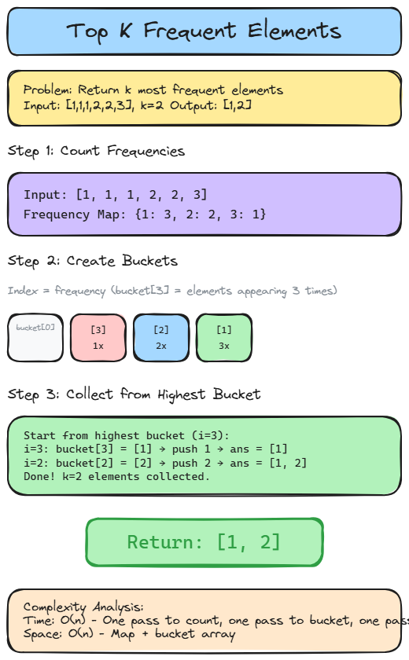

# 📊 Solution 4 — Top K Frequent Elements

> **📁 File:** `src/top-k-frequent/solution.ts`


## 📋 Problem

Given an integer array `nums` and an integer `k`, return the `k` most frequent elements.

**🎯 Example:**
```
Input:  nums = [1, 1, 1, 2, 2, 3], k = 2
Output: [1, 2]  → 1 appears 3 times, 2 appears 2 times
```

## 💻 The Code

```typescript
export function topKFrequent(nums: number[], k: number): number[] {
  // Step 1: Count frequencies
  const frequentMap = new Map<number, number>();

  for (const num of nums) {
    if (!frequentMap.has(num)) {
      frequentMap.set(num, 1);
    } else {
      frequentMap.set(num, (frequentMap.get(num) as number) + 1);
    }
  }

  // Step 2: Create buckets (index = frequency)
  const bucket: number[][] = new Array(nums.length + 1).fill([]).map(() => []);

  for (const entry of frequentMap.entries()) {
    const [key, value] = entry;
    bucket[value]?.push(key);
  }

  // Step 3: Collect top k from highest bucket
  const ans: number[] = [];
  for (let i = bucket.length - 1; i >= 0 && ans.length < k; i--) {
    const elements = bucket[i] || [];

    for (const element of elements) {
      ans.push(element);
      if (ans.length === k) break;
    }
  }
  return ans;
}
```

## 📖 Step-by-Step Explanation

Let's say input is:

```ts
nums = [1, 1, 1, 2, 2, 3], k = 2
```

---

### 🔹 Step 1 — Build Frequency Map

First, create an empty Map.

```ts
const frequentMap = new Map<number, number>();
```

Map is now:

```
Map {}
```

Now loop through each number and count how many times it appears.

---

#### 🔄 1st Iteration

```ts
num = 1
```

```ts
frequentMap.has(1) → ❌ false
```

1 is not in the Map yet.

```ts
frequentMap.set(1, 1)
```

Map is now:

```
{1 → 1}
```

> 📝 **1** has appeared **1 time** so far.

---

#### 🔄 2nd Iteration

```ts
num = 1
```

```ts
frequentMap.has(1) → ✅ true
```

1 is already in the Map!

```ts
frequentMap.set(1, frequentMap.get(1) + 1)
           = frequentMap.set(1, 1 + 1)
           = frequentMap.set(1, 2)
```

Map is now:

```
{1 → 2}
```

> 📝 **1** now appears **2 times**.

---

#### 🔄 3rd Iteration

```ts
num = 1
```

```ts
frequentMap.has(1) → ✅ true
frequentMap.set(1, 2 + 1) = frequentMap.set(1, 3)
```

Map is now:

```
{1 → 3}
```

> 📝 **1** now appears **3 times**.

---

#### 🔄 4th Iteration

```ts
num = 2
```

```ts
frequentMap.has(2) → ❌ false
frequentMap.set(2, 1)
```

Map is now:

```
{1 → 3, 2 → 1}
```

---

#### 🔄 5th Iteration

```ts
num = 2
```

```ts
frequentMap.has(2) → ✅ true
frequentMap.set(2, 1 + 1) = frequentMap.set(2, 2)
```

Map is now:

```
{1 → 3, 2 → 2}
```

---

#### 🔄 6th Iteration

```ts
num = 3
```

```ts
frequentMap.has(3) → ❌ false
frequentMap.set(3, 1)
```

Map is now:

```
{1 → 3, 2 → 2, 3 → 1}
```

> ✅ **Step 1 complete.** Now we know:
> - **1** appears 3 times
> - **2** appears 2 times
> - **3** appears 1 time

---

### 🔹 Step 2 — Create Buckets

```ts
const bucket: number[][] = new Array(nums.length + 1).fill([]).map(() => []);
```

`nums.length + 1 = 7` → 7 empty arrays created.

**💡 Why index = frequency?**

The bucket's index represents **how many times** an element appears:
- `bucket[0]` = elements that appear 0 times
- `bucket[1]` = elements that appear 1 time
- `bucket[2]` = elements that appear 2 times
- `bucket[3]` = elements that appear 3 times
- ...and so on

Initially all empty:

```
bucket index:  0    1    2    3    4    5    6
bucket value: [[]] [[]] [[]] [[]] [[]] [[]] [[]]
```

Now we fill buckets from the Map.

---

#### 📝 1st entry: [1, 3]

```ts
key = 1, value = 3
```

```ts
bucket[3].push(1)
```

```
bucket index:  0    1    2    3       4    5    6
bucket value: [[]] [[]] [[]] [1]     [[]] [[]] [[]]
```

> 📝 **1** appears 3 times, so it goes into `bucket[3]`.

---

#### 📝 2nd entry: [2, 2]

```ts
key = 2, value = 2
```

```ts
bucket[2].push(2)
```

```
bucket index:  0    1    2    3       4    5    6
bucket value: [[]] [[]] [2]  [1]     [[]] [[]] [[]]
```

> 📝 **2** appears 2 times, so it goes into `bucket[2]`.

---

#### 📝 3rd entry: [3, 1]

```ts
key = 3, value = 1
```

```ts
bucket[1].push(3)
```

```
bucket index:  0    1    2    3       4    5    6
bucket value: [[]] [3]  [2]  [1]     [[]] [[]] [[]]
```

> 📝 **3** appears 1 time, so it goes into `bucket[1]`.

> ✅ **Step 2 complete.** Buckets now:

```
bucket[0] = []
bucket[1] = [3]      ← appears 1 time
bucket[2] = [2]      ← appears 2 times
bucket[3] = [1]      ← appears 3 times
bucket[4] = []
bucket[5] = []
bucket[6] = []
```

---

### 🔹 Step 3 — Collect from highest bucket

```ts
const ans: number[] = [];
for (let i = bucket.length - 1; i >= 0 && ans.length < k; i--) {
```

Start from `i = 6` (highest frequency) and go down.

We need `k = 2` elements.

---

#### 🔄 i = 6

```ts
bucket[6] = []
```

Empty. ⏭️ Skip.

---

#### 🔄 i = 5

```ts
bucket[5] = []
```

Empty. ⏭️ Skip.

---

#### 🔄 i = 4

```ts
bucket[4] = []
```

Empty. ⏭️ Skip.

---

#### 🔄 i = 3

```ts
bucket[3] = [1]
```

**1** is here!

```ts
ans.push(1)
ans = [1]
ans.length = 1
```

`1 !== 2 (k)` → still need one more.

---

#### 🔄 i = 2

```ts
bucket[2] = [2]
```

**2** is here!

```ts
ans.push(2)
ans = [1, 2]
ans.length = 2
```

`2 === 2 (k)` → **done! 🛑 break.**

---

### 🎯 Return

```ts
return [1, 2]
```

> 🎉 **Correct!** 1 appears 3 times, 2 appears 2 times — the two most frequent.

---

### ❓ What if k = 3?

```
i = 3: push(1) → ans = [1]
i = 2: push(2) → ans = [1, 2]
i = 1: push(3) → ans = [1, 2, 3]  → 3 === k → 🛑 done
```

Return `[1, 2, 3]` — all three.

---

### ⏱️ Complexity

| Metric | Value | Why |
|--------|-------|-----|
| 🕐 Time | `O(n)` | One pass to count, one pass to bucket, one pass to collect |
| 💾 Space | `O(n)` | Map + bucket array |

### ▶️ How to Run

```bash
npx tsx src/top-k-frequent/solution.ts
```

---


