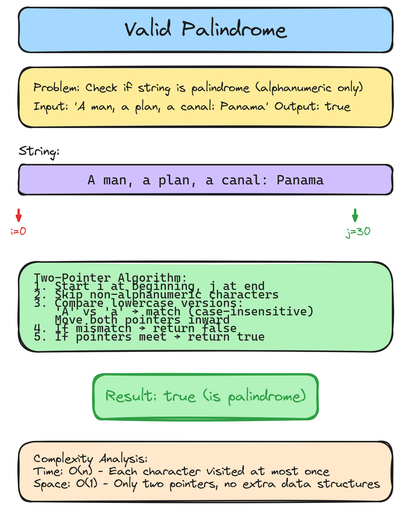

# 👉 Solution 10 — Valid Palindrome

> **📁 File:** `src/valid-palindrome/solution.ts`


## 📋 Problem

Given a string `s`, determine if it is a palindrome, considering only alphanumeric characters and ignoring cases.

**🎯 Example:**
```
Input:  "A man, a plan, a canal: Panama"
Output: true

Input:  "race a car"
Output: false
```

## 💻 The Code

```typescript
export function isPalindrome(s: string): boolean {
  let i = 0;
  let j = s.length - 1;
  function nonAlpha(str: string) {
    return str.replace(/[^a-zA-Z0-9]/g, "");
  }

  while (i < j) {
    const left = s[i]!;
    const right = s[j]!;
    if (nonAlpha(left) === "") {
      i++;
      continue;
    }

    if (nonAlpha(right) === "") {
      j--;
      continue;
    }

    if (nonAlpha(left).toLowerCase() !== nonAlpha(right).toLowerCase()) {
      return false;
    }

    i++;
    j--;
  }

  return true;
}
```

## 📖 Step-by-Step Explanation

1. **Two pointers** start at opposite ends of the string — `i` at the beginning, `j` at the end.
2. At each step, skip non-alphanumeric characters by checking if `nonAlpha()` returns an empty string.
3. Compare the lowercase versions of both characters. If they don't match, return `false`.
4. Move pointers inward and repeat until they meet.
5. If all pairs matched, return `true`.

**Walkthrough with `"A man, a plan, a canal: Panama"`:**
- `i=0` ('A') vs `j=30` ('a') → both alpha, lowercase match → move in
- `i=1` (' ') → skip. `i=2` ('m') vs `j=29` ('m') → match
- Continue skipping spaces/punctuation, comparing letters...
- All pairs match → `true`

### ⏱️ Complexity

| Metric | Value | Why |
|--------|-------|-----|
| 🕐 Time | `O(n)` | Each character visited at most once |
| 💾 Space | `O(1)` | Only two pointers, no extra data structures |

### ▶️ How to Run

```bash
npx tsx src/valid-palindrome/solution.ts
```

---


